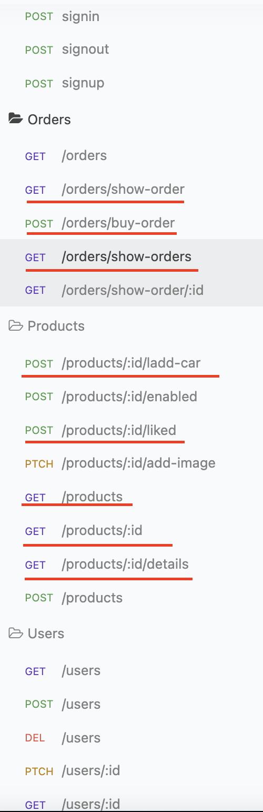
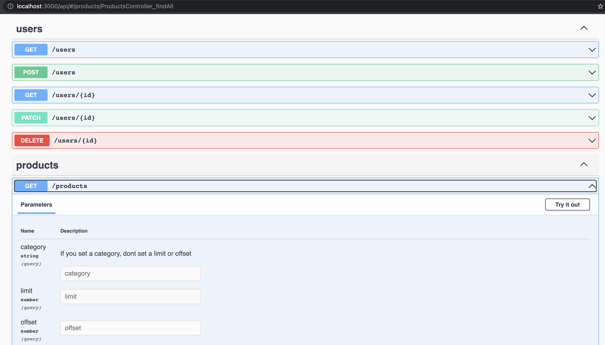

# Nest Assignment

- npm install
- set .env variables
- npm run start:dev

use signup endpoint for register a user, it can be a client or manager( "role": "client" , "role": "manager")

## Descripcion

El presente repositorio es del desafio de nestjs, en resumen consiste en dos tipos de usuarios, un cliente y un administrador (client, manager). Para empezar se puede acceder al endpoint 'signup' y se registra con un correo, contraseña y el tipo de usuaio. Luego se procede a iniciar sesion con 'signin', para asi obtener el token y poder acceder a los demas endpoints. Como manager, se puede agregar productos. Una vez añadidos se puede agregar diferentes productos al carrito de compras, los productos por el momento no tienen stock y se añaden una vez a la orden, una orden puede tener muchos productos. Para terminar la compra se usa el endpoint 'orders/buy-order' y terminaria el flujo. Existen mas funcionalidades las cuales se pueden ver '/api' con swagger. Se adjuntan imagenes de referencia. (Nota: aun en desarrollo)

- Signup

  

- Signin

  

- create_product

  

- add_car

  

- buy

  

- client routes

  

- swagger

  

Author - Iam Contreras
